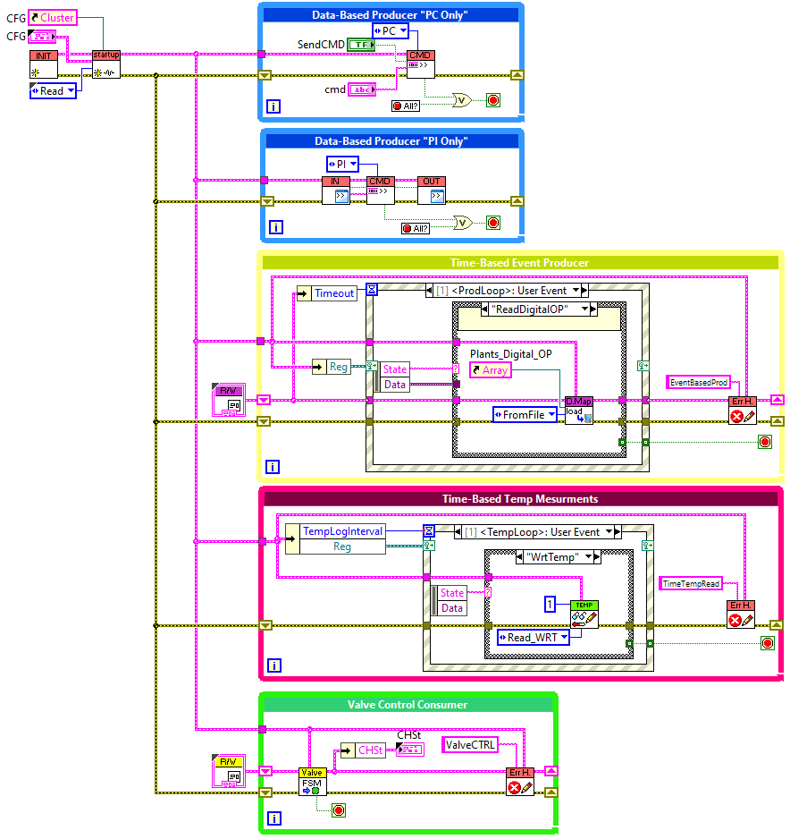
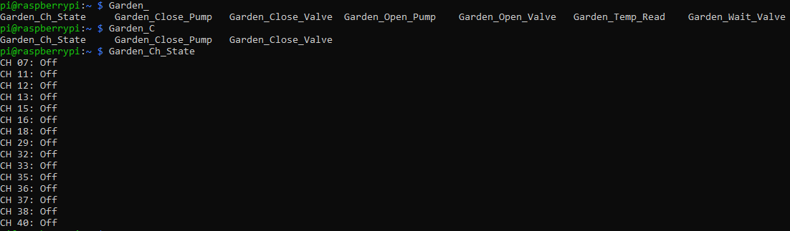

# Watering System
This watering system was designed to water plants based on a timetable.
## LabVIEW Version
LabVIEW community 2021. [Download from here](https://www.ni.com/en-gb/support/downloads/software-products/download.labview-community.html)
## Preparing the Pi
[Installing LabVIEW runtine on RPI](https://www.labviewmakerhub.com/doku.php?id=learn:tutorials:libraries:linx:3-0:raspberry-pi-setup)

https://www.mediamongrels.com/make-ing-with-labview-raspberry-pi-part-3-raspberry-pi-setup/

https://www.labviewmakerhub.com/doku.php?id=learn:tutorials:libraries:linx:3-0

## Code Structure
THe Main.vi has 3 Producers, 1 consumer and 1 Temperature loggong loop

### The producers
1. Data-Based Producer "PC Only": Used to communicate during development.
2. Data-Based Producer "Pi Only": Used to commuincate through RPI's terminal 
3. Time-Based Event Producer: User-indepent producer which reads the timetable and send a command to a specifif valve.
```consol
Files Tree			Description
├── Consol			The content of this folder is used for the terminal interface
│	├── CH_Stat		Reading this file gives the state of all channels
│	├── Input		A command is writed to this file
│	├── Output		The return of a command is written into this file
│	├── Timeout		The next timeout value is written into this file
│	└── TimeoutTable	Read this file to get the time table
├── Logs                        Containts different log files
│	├── Error               Error log file
│	├── StartTime           Last startup time
│	├── Temp                Temperature log
│	└── WateringLog         Watering log file
└── Settings
 	├── CFG.ini
	├── Plant_Digital_OP
	├── RstFlag
	├── TimeTable
	└── TimeTable.save
```
#### The Pi Producer
The Pi Producer can be used during the development and deployment. The LINX library has no native method to communicate through terminal interface. The workaround was to make a data-based producer loop[[1]](#1). The polling rate is defined in the CFG cluster "Producer_PI Speed [ms]". The cluster is stored:

	/home/pi/GardenApp/Settings/CFG.ini

The commands to the Pi Producer must be written to ../Consol/Input. The Data_Prod.vi will read the file and remove the entered text. If any error happend in the Pi Producer it will be written to the ../Consol/Output file. Functions can be added to the .bashrc file to automate the commands as follows

```consol
Garden_Open_Valve() { echo "Valve -Open Valve -$1" | sudo tee -a /home/pi/GardenApp/Consol/Input ;sleep 2;more /home/pi/GardenApp/Consol/Output; echo''|sudo touch /home/pi/GardenApp/Consol/Output;}
Garden_Close_Valve() { echo "Valve -Close Valve -$1" | sudo tee -a /home/pi/GardenApp/Consol/Input ;sleep 2;more /home/pi/GardenApp/Consol/Output; echo''|sudo touch /home/pi/GardenApp/Consol/Output;}
Garden_Open_Pump() { echo "Valve -Open Pump -$1 -" | sudo tee -a /home/pi/GardenApp/Consol/Input ;sleep 2;more /home/pi/GardenApp/Consol/Output; echo''|sudo touch /home/pi/GardenApp/Consol/Output;}
Garden_Close_Pump() { echo "Valve -Close Pump -$1 -" | sudo tee -a /home/pi/GardenApp/Consol/Input ;sleep 2;more /home/pi/GardenApp/Consol/Output; echo''|sudo touch /home/pi/GardenApp/Consol/Output;}
Garden_Wait_Valve() { echo "Valve -Wait Valve -$1 -$2" | sudo tee -a /home/pi/GardenApp/Consol/Input ;sleep 2;more /home/pi/GardenApp/Consol/Output; echo''|sudo touch /home/pi/GardenApp/Consol/Output;}
Garden_Ch_State() { more /home/pi/GardenApp/Consol/CH_Stat;}
Garden_Temp_Read() { echo "Temp -Read" | sudo tee -a /home/pi/GardenApp/Consol/Input ;sleep 2;more /home/pi/GardenApp/Consol/Output;more /home/pi/GardenApp/Consol/Temp; echo''|sudo touch /home/pi/GardenApp/Consol/Output;}
```
By adding the previous functions to the end of .bashrc file. The commands will be avaailbe through the terminal auto-complete, as shown in the next exmaple:


## References
<a id="1">[1]</a>
https://www.ni.com/en-gb/support/documentation/supplemental/21/producer-consumer-architecture-in-labview0.html
